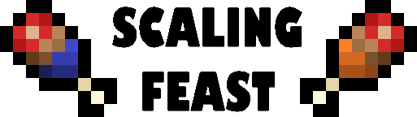

## [Scaling Feast](https://www.curseforge.com/minecraft/mc-mods/scaling-feast)

[](https://github.com/yeelp/Scaling-Feast/issues)

A simple, balanced way to increase your maximum hunger in Minecraft over the course of a world.

This mod requires [Apple Core](https://www.curseforge.com/minecraft/mc-mods/applecore)!
 
### Using Gradle With Scaling Feast (Building and Contributing)

If you want to either build or contribute to this mod, here's how to get started. This guide assumes you have Java 8 set up on your machine, complete with corresponding changes to the PATH environment variable and setting JAVA_HOME. If you don't have that set up, do that first. I am not describing the process here, nor am I linking a tutorial here. I am not responsible for any damaging changes to your machine when altering environment variables. Be careful and make sure you understand what you are doing. Make backups, and use an **up to date tutorial** for **YOUR** operating system.

If you want to build Scaling Feast, clone this repository, then navigate to the directory where you cloned this repository using any shell, then execute
```
gradlew build
```
from inside the directory.

If you want to contribute, make sure you know how to get and setup the latest Forge MDK for Minecraft 1.12.2. Then, clone this repository, navigate to that directory, much like before, and execute
```
gradlew setupDecompWorkspace
```
Then, finish the usual Forge modding setup. 

You should always create a new branch on your local repository using
```
git branch <branchName>
```
where branchName is the name of your branch. Then, switch to it with
```
git checkout <branchName>
```

Now you're all setup to contribute. Commit changes to your branch and when your contributions are complete, open a pull request. Be sure to label your pull request appropriately and to link all issues your pull request will close. Be sure to refer to CONTRIBUTING.md to understand the guidelines for contributing.

If any of these instructions are incorrect, please open an issue with the housekeeping label, describing what's wrong and how it should be changed.
